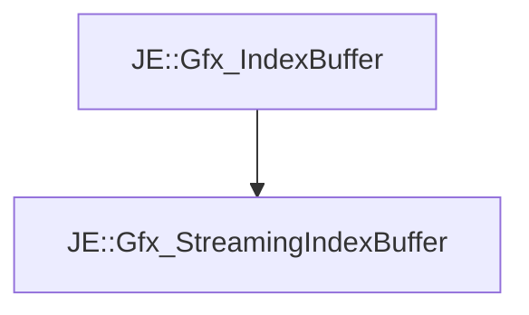

# JE::Gfx_StreamingIndexBuffer

[Return to `JE`](/docs/je.md)

## C++

- [`Gfx_StreamingIndexBuffer.hpp`](/src/je/Gfx_StreamingIndexBuffer.hpp)
- [`Gfx_StreamingIndexBuffer.cpp`](/src/je/Gfx_StreamingIndexBuffer.cpp)

## References

- [`JE::Gfx_IndexBuffer`](/docs/je/Gfx_IndexBuffer.md)

## Inheritance

[Return to `JE`](/docs/je.md)