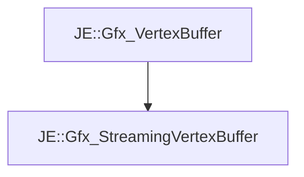

# JE::Gfx_StreamingVertexBuffer

[Return to `je`](/docs/je.md)

## C++

- [`Gfx_StreamingVertexBuffer.hpp`](/src/je/Gfx_StreamingVertexBuffer.hpp)
- [`Gfx_StreamingVertexBuffer.cpp`](/src/je/Gfx_StreamingVertexBuffer.cpp)

## References

- [`JE::Gfx_VertexBuffer`](/docs/je/Gfx_VertexBuffer.md)

## Inheritance

[Return to `je`](/docs/je.md)