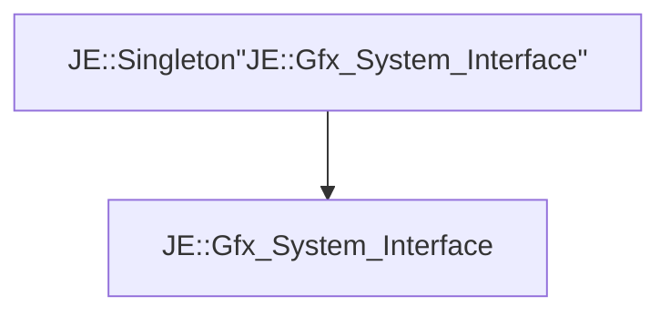

# JE::Gfx_System_Interface

[Return to `je`](/docs/je.md)

## C++

- [`Gfx_System_Interface.hpp`](/src/je/Gfx_System_Interface.hpp)
- [`Gfx_System_Interface.cpp`](/src/je/Gfx_System_Interface.cpp)

## References

- [`JE::Singleton`](/docs/je/Singleton.md)

## Inheritance

[Return to `je`](/docs/je.md)