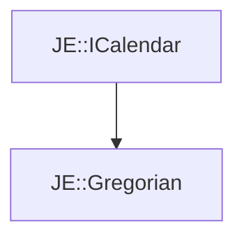

# JE::Gregorian

[Return to `je`](/docs/je.md)

## C++

- [`Gregorian.hpp`](/src/je/Gregorian.hpp)
- [`Gregorian.cpp`](/src/je/Gregorian.cpp)

## References

- [`JE::ICalendar`](/docs/je/ICalendar.md)

## Inheritance

[Return to `je`](/docs/je.md)