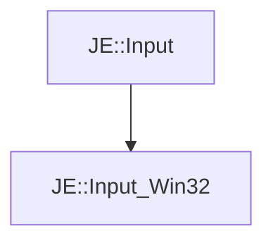

# JE::Input_Win32

[Return to `je`](/docs/je.md)

## C++

- [`Input_Win32.hpp`](/src/je/Input_Win32.hpp)
- [`Input_Win32.cpp`](/src/je/Input_Win32.cpp)

## References

- [`JE::Input`](/docs/je/Input.md)

## Inheritance

[Return to `je`](/docs/je.md)