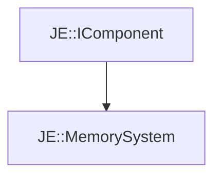

# JE::MemorySystem

[Return to `JE`](/docs/je.md)

## C++

- [`MemorySystem.hpp`](/src/je/MemorySystem.hpp)
- [`MemorySystem.cpp`](/src/je/MemorySystem.cpp)

## References

- [`JE::IComponent`](/docs/je/IComponent.md)

## Inheritance

[Return to `JE`](/docs/je.md)