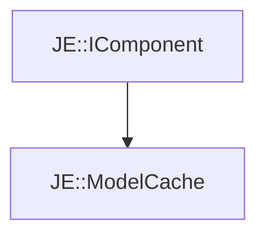

# JE::ModelCache

[Return to `je`](/docs/je.md)

## C++

- [`ModelCache.hpp`](/src/je/ModelCache.hpp)
- [`ModelCache.cpp`](/src/je/ModelCache.cpp)

## References

- [`JE::IComponent`](/docs/je/IComponent.md)

## Inheritance

[Return to `je`](/docs/je.md)