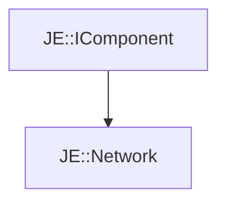

# JE::Network

[Return to `je`](/docs/je.md)

## C++

- [`Network.hpp`](/src/je/Network.hpp)
- [`Network.cpp`](/src/je/Network.cpp)

## References

- [`JE::IComponent`](/docs/je/IComponent.md)

## Inheritance

[Return to `je`](/docs/je.md)