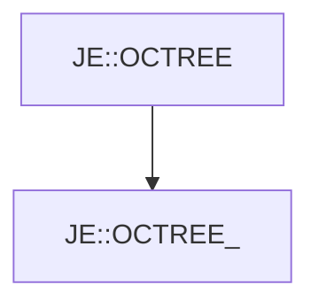

# JE::OCTREE_

[Return to `JE`](/docs/je.md)

## C++

- [`OCTREE_.hpp`](/src/je/OCTREE_.hpp)
- [`OCTREE_.cpp`](/src/je/OCTREE_.cpp)

## References

- [`JE::OCTREE`](/docs/je/OCTREE.md)

## Inheritance

[Return to `JE`](/docs/je.md)