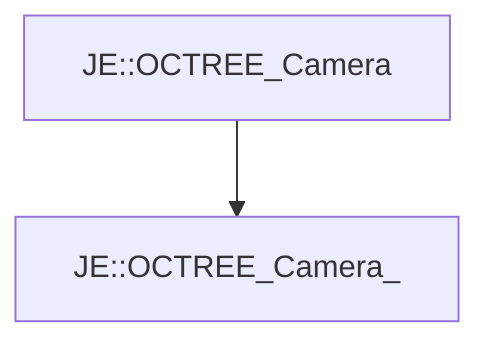

# JE::OCTREE_Camera_

[Return to `JE`](/docs/je.md)

## C++

- [`OCTREE_Camera_.hpp`](/src/je/OCTREE_Camera_.hpp)
- [`OCTREE_Camera_.cpp`](/src/je/OCTREE_Camera_.cpp)

## References

- [`JE::OCTREE_Camera`](/docs/je/OCTREE_Camera.md)

## Inheritance

[Return to `JE`](/docs/je.md)