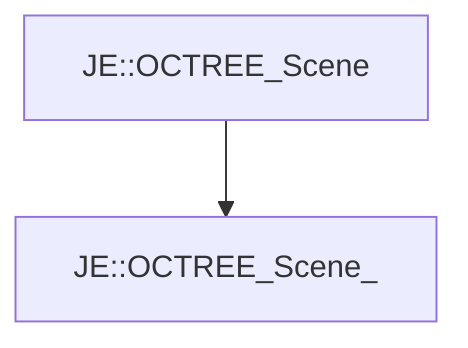

# JE::OCTREE_Scene_

[Return to `JE`](/docs/je.md)

## C++

- [`OCTREE_Scene_.hpp`](/src/je/OCTREE_Scene_.hpp)
- [`OCTREE_Scene_.cpp`](/src/je/OCTREE_Scene_.cpp)

## References

- [`JE::OCTREE_Scene`](/docs/je/OCTREE_Scene.md)

## Inheritance

[Return to `JE`](/docs/je.md)