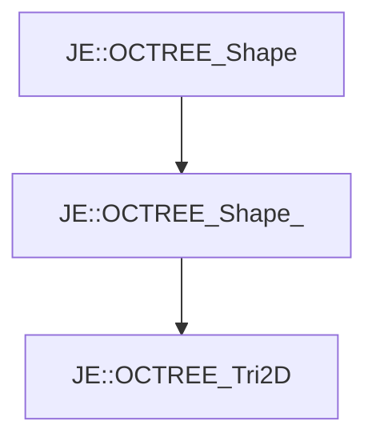

# JE::OCTREE_Tri2D

[Return to `je`](/docs/je.md)

## C++

- [`OCTREE_Tri2D.hpp`](/src/je/OCTREE_Tri2D.hpp)
- [`OCTREE_Tri2D.cpp`](/src/je/OCTREE_Tri2D.cpp)

## References

- [`JE::OCTREE_Shape`](/docs/je/OCTREE_Shape.md)
- [`JE::OCTREE_Shape_`](/docs/je/OCTREE_Shape_.md)

## Inheritance

[Return to `je`](/docs/je.md)