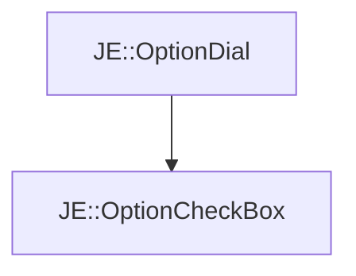

# JE::OptionCheckBox

[Return to `JE`](/docs/je.md)

## C++

- [`OptionCheckBox.hpp`](/src/je/OptionCheckBox.hpp)
- [`OptionCheckBox.cpp`](/src/je/OptionCheckBox.cpp)

## References

- [`JE::OptionDial`](/docs/je/OptionDial.md)

## Inheritance

[Return to `JE`](/docs/je.md)