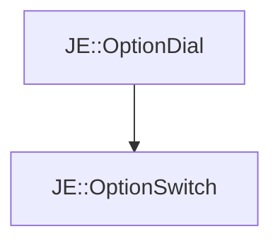

# JE::OptionSwitch

[Return to `JE`](/docs/je.md)

## C++

- [`OptionSwitch.hpp`](/src/je/OptionSwitch.hpp)
- [`OptionSwitch.cpp`](/src/je/OptionSwitch.cpp)

## References

- [`JE::OptionDial`](/docs/je/OptionDial.md)

## Inheritance

[Return to `JE`](/docs/je.md)