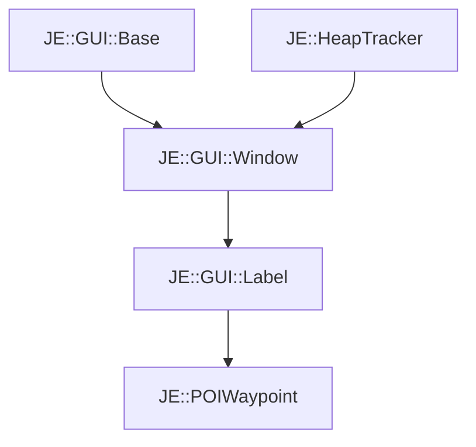

# JE::POIWaypoint

[Return to `JE`](/docs/je.md)

## C++

- [`POIWaypoint.hpp`](/src/je/POIWaypoint.hpp)
- [`POIWaypoint.cpp`](/src/je/POIWaypoint.cpp)

## References

- [`JE::GUI::Base`](/docs/je/GUI/Base.md)
- [`JE::HeapTracker`](/docs/je/HeapTracker.md)
- [`JE::GUI::Window`](/docs/je/GUI/Window.md)
- [`JE::GUI::Label`](/docs/je/GUI/Label.md)

## Inheritance

[Return to `JE`](/docs/je.md)