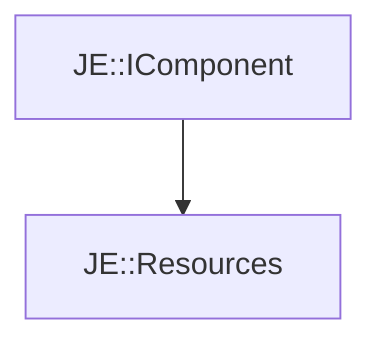

# JE::Resources

[Return to `JE`](/docs/je.md)

## C++

- [`Resources.hpp`](/src/je/Resources.hpp)
- [`Resources.cpp`](/src/je/Resources.cpp)

## References

- [`JE::IComponent`](/docs/je/IComponent.md)

## Inheritance

[Return to `JE`](/docs/je.md)