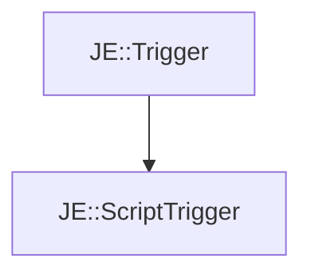

# JE::ScriptTrigger

[Return to `je`](/docs/je.md)

## C++

- [`ScriptTrigger.hpp`](/src/je/ScriptTrigger.hpp)
- [`ScriptTrigger.cpp`](/src/je/ScriptTrigger.cpp)

## References

- [`JE::Trigger`](/docs/je/Trigger.md)

## Inheritance

[Return to `je`](/docs/je.md)