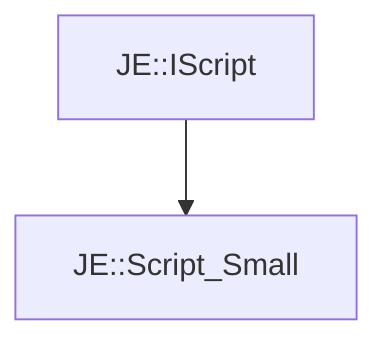

# JE::Script_Small

[Return to `je`](/docs/je.md)

## C++

- [`Script_Small.hpp`](/src/je/Script_Small.hpp)
- [`Script_Small.cpp`](/src/je/Script_Small.cpp)

## References

- [`JE::IScript`](/docs/je/IScript.md)

## Inheritance

[Return to `je`](/docs/je.md)