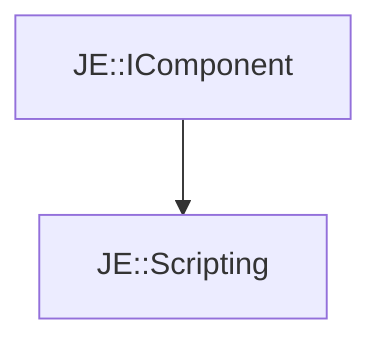

# JE::Scripting

[Return to `JE`](/docs/je.md)

## C++

- [`Scripting.hpp`](/src/je/Scripting.hpp)
- [`Scripting.cpp`](/src/je/Scripting.cpp)

## References

- [`JE::IComponent`](/docs/je/IComponent.md)

## Inheritance

[Return to `JE`](/docs/je.md)