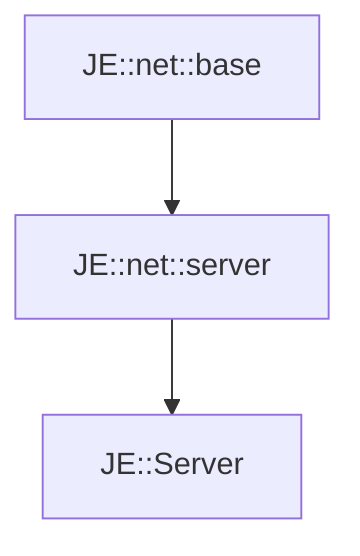

# JE::Server

[Return to `JE`](/docs/je.md)

## C++

- [`Server.hpp`](/src/je/Server.hpp)
- [`Server.cpp`](/src/je/Server.cpp)

## References

- [`JE::net::base`](/docs/net/base.md)
- [`JE::net::server`](/docs/net/server.md)

## Inheritance

[Return to `JE`](/docs/je.md)