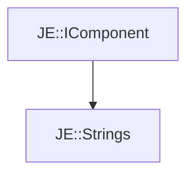

# JE::Strings

[Return to `JE`](/docs/je.md)

## C++

- [`Strings.hpp`](/src/je/Strings.hpp)
- [`Strings.cpp`](/src/je/Strings.cpp)

## References

- [`JE::IComponent`](/docs/je/IComponent.md)

## Inheritance

[Return to `JE`](/docs/je.md)