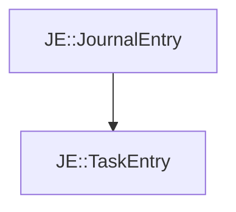

# JE::TaskEntry

[Return to `JE`](/docs/je.md)

## C++

- [`TaskEntry.hpp`](/src/je/TaskEntry.hpp)
- [`TaskEntry.cpp`](/src/je/TaskEntry.cpp)

## References

- [`JE::JournalEntry`](/docs/je/JournalEntry.md)

## Inheritance

[Return to `JE`](/docs/je.md)