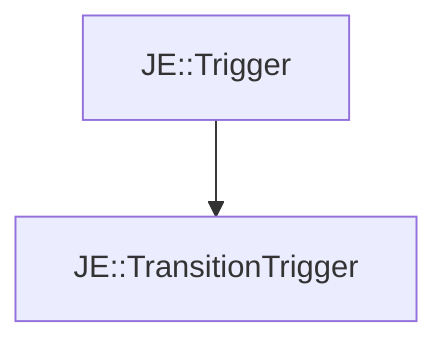

# JE::TransitionTrigger

[Return to `JE`](/docs/je.md)

## C++

- [`TransitionTrigger.hpp`](/src/je/TransitionTrigger.hpp)
- [`TransitionTrigger.cpp`](/src/je/TransitionTrigger.cpp)

## References

- [`JE::Trigger`](/docs/je/Trigger.md)

## Inheritance

[Return to `JE`](/docs/je.md)