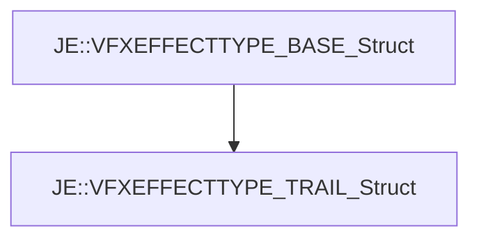

# JE::VFXEFFECTTYPE_TRAIL_Struct

[Return to `JE`](/docs/je.md)

## C++

- [`VFXEFFECTTYPE_TRAIL_Struct.hpp`](/src/je/VFXEFFECTTYPE_TRAIL_Struct.hpp)
- [`VFXEFFECTTYPE_TRAIL_Struct.cpp`](/src/je/VFXEFFECTTYPE_TRAIL_Struct.cpp)

## References

- [`JE::VFXEFFECTTYPE_BASE_Struct`](/docs/je/VFXEFFECTTYPE_BASE_Struct.md)

## Inheritance

[Return to `JE`](/docs/je.md)