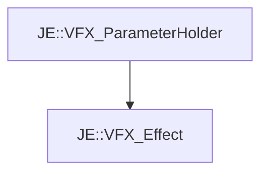

# JE::VFX_Effect

[Return to `je`](/docs/je.md)

## C++

- [`VFX_Effect.hpp`](/src/je/VFX_Effect.hpp)
- [`VFX_Effect.cpp`](/src/je/VFX_Effect.cpp)

## References

- [`JE::VFX_ParameterHolder`](/docs/je/VFX_ParameterHolder.md)

## Inheritance

[Return to `je`](/docs/je.md)