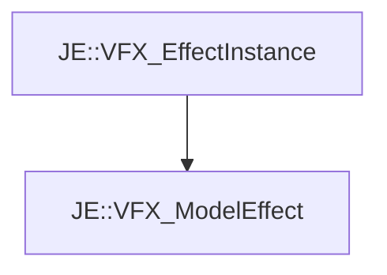

# JE::VFX_ModelEffect

[Return to `JE`](/docs/je.md)

## C++

- [`VFX_ModelEffect.hpp`](/src/je/VFX_ModelEffect.hpp)
- [`VFX_ModelEffect.cpp`](/src/je/VFX_ModelEffect.cpp)

## References

- [`JE::VFX_EffectInstance`](/docs/je/VFX_EffectInstance.md)

## Inheritance

[Return to `JE`](/docs/je.md)