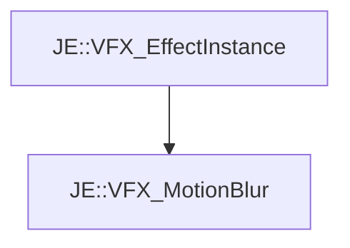

# JE::VFX_MotionBlur

[Return to `je`](/docs/je.md)

## C++

- [`VFX_MotionBlur.hpp`](/src/je/VFX_MotionBlur.hpp)
- [`VFX_MotionBlur.cpp`](/src/je/VFX_MotionBlur.cpp)

## References

- [`JE::VFX_EffectInstance`](/docs/je/VFX_EffectInstance.md)

## Inheritance

[Return to `je`](/docs/je.md)