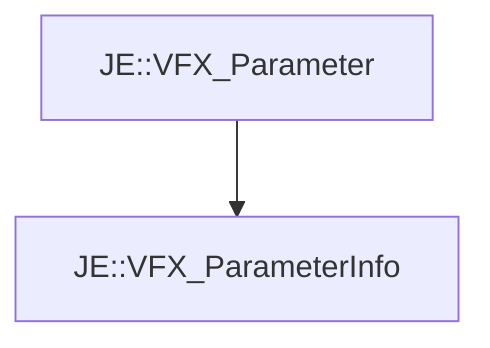

# JE::VFX_ParameterInfo

[Return to `je`](/docs/je.md)

## C++

- [`VFX_ParameterInfo.hpp`](/src/je/VFX_ParameterInfo.hpp)
- [`VFX_ParameterInfo.cpp`](/src/je/VFX_ParameterInfo.cpp)

## References

- [`JE::VFX_Parameter`](/docs/je/VFX_Parameter.md)

## Inheritance

[Return to `je`](/docs/je.md)