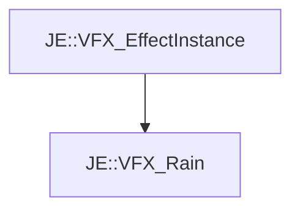

# JE::VFX_Rain

[Return to `JE`](/docs/je.md)

## C++

- [`VFX_Rain.hpp`](/src/je/VFX_Rain.hpp)
- [`VFX_Rain.cpp`](/src/je/VFX_Rain.cpp)

## References

- [`JE::VFX_EffectInstance`](/docs/je/VFX_EffectInstance.md)

## Inheritance

[Return to `JE`](/docs/je.md)