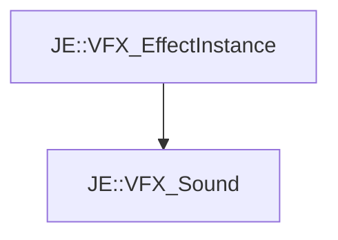

# JE::VFX_Sound

[Return to `je`](/docs/je.md)

## C++

- [`VFX_Sound.hpp`](/src/je/VFX_Sound.hpp)
- [`VFX_Sound.cpp`](/src/je/VFX_Sound.cpp)

## References

- [`JE::VFX_EffectInstance`](/docs/je/VFX_EffectInstance.md)

## Inheritance

[Return to `je`](/docs/je.md)