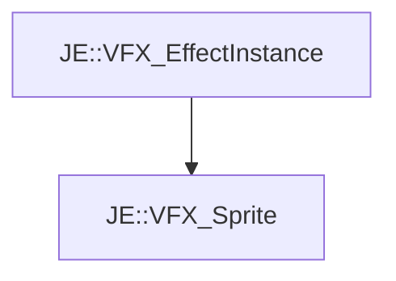

# JE::VFX_Sprite

[Return to `je`](/docs/je.md)

## C++

- [`VFX_Sprite.hpp`](/src/je/VFX_Sprite.hpp)
- [`VFX_Sprite.cpp`](/src/je/VFX_Sprite.cpp)

## References

- [`JE::VFX_EffectInstance`](/docs/je/VFX_EffectInstance.md)

## Inheritance

[Return to `je`](/docs/je.md)