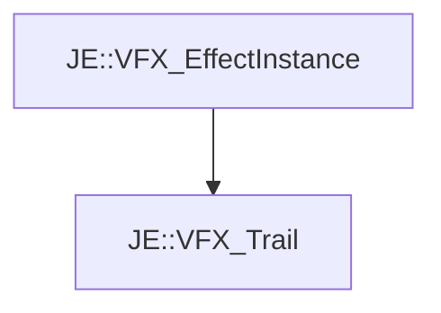

# JE::VFX_Trail

[Return to `JE`](/docs/je.md)

## C++

- [`VFX_Trail.hpp`](/src/je/VFX_Trail.hpp)
- [`VFX_Trail.cpp`](/src/je/VFX_Trail.cpp)

## References

- [`JE::VFX_EffectInstance`](/docs/je/VFX_EffectInstance.md)

## Inheritance

[Return to `JE`](/docs/je.md)