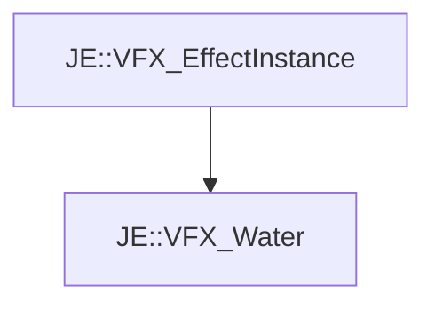

# JE::VFX_Water

[Return to `je`](/docs/je.md)

## C++

- [`VFX_Water.hpp`](/src/je/VFX_Water.hpp)
- [`VFX_Water.cpp`](/src/je/VFX_Water.cpp)

## References

- [`JE::VFX_EffectInstance`](/docs/je/VFX_EffectInstance.md)

## Inheritance

[Return to `je`](/docs/je.md)