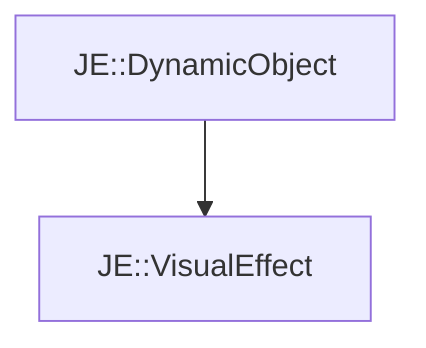

# JE::VisualEffect

[Return to `JE`](/docs/je.md)

## C++

- [`VisualEffect.hpp`](/src/je/VisualEffect.hpp)
- [`VisualEffect.cpp`](/src/je/VisualEffect.cpp)

## References

- [`JE::DynamicObject`](/docs/je/DynamicObject.md)

## Inheritance

[Return to `JE`](/docs/je.md)