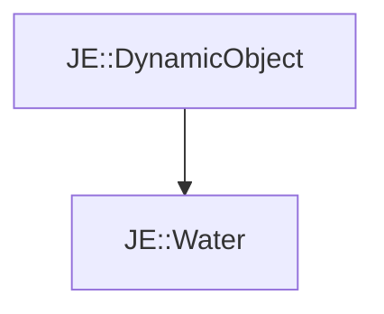

# JE::Water

[Return to `je`](/docs/je.md)

## C++

- [`Water.hpp`](/src/je/Water.hpp)
- [`Water.cpp`](/src/je/Water.cpp)

## References

- [`JE::DynamicObject`](/docs/je/DynamicObject.md)

## Inheritance

[Return to `je`](/docs/je.md)