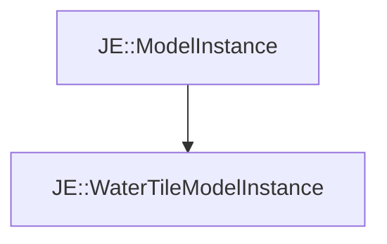

# JE::WaterTileModelInstance

[Return to `je`](/docs/je.md)

## C++

- [`WaterTileModelInstance.hpp`](/src/je/WaterTileModelInstance.hpp)
- [`WaterTileModelInstance.cpp`](/src/je/WaterTileModelInstance.cpp)

## References

- [`JE::ModelInstance`](/docs/je/ModelInstance.md)

## Inheritance

[Return to `je`](/docs/je.md)