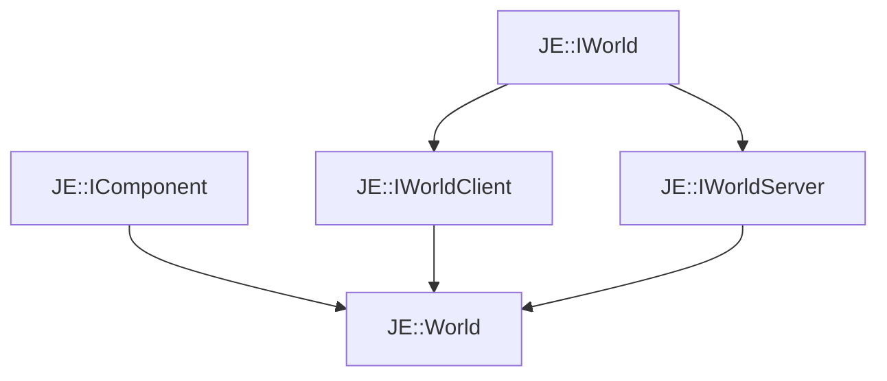

# JE::World

[Return to `je`](/docs/je.md)

## C++

- [`World.hpp`](/src/je/World.hpp)
- [`World.cpp`](/src/je/World.cpp)

## References

- [`JE::IWorld`](/docs/je/IWorld.md)
- [`JE::IComponent`](/docs/je/IComponent.md)
- [`JE::IWorldClient`](/docs/je/IWorldClient.md)
- [`JE::IWorldServer`](/docs/je/IWorldServer.md)

## Inheritance

[Return to `je`](/docs/je.md)