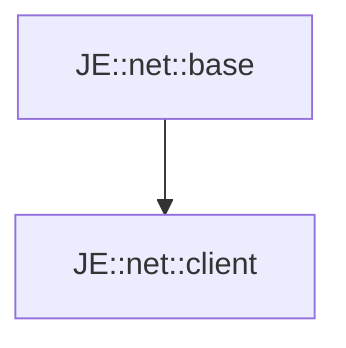

# JE::net::client

[Return to `net`](/docs/net.md)

## References

- [`JE::net::base`](/docs/net/base.md)

## Inheritance

```mermaid
graph TD;
    JE::net::base --> JE::net::client;
```

[Return to `net`](/docs/net.md)